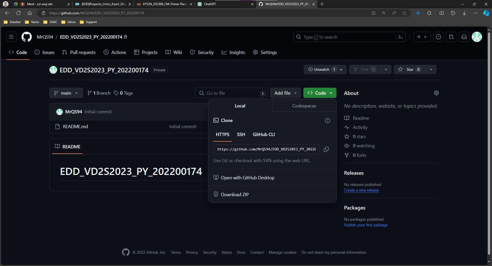
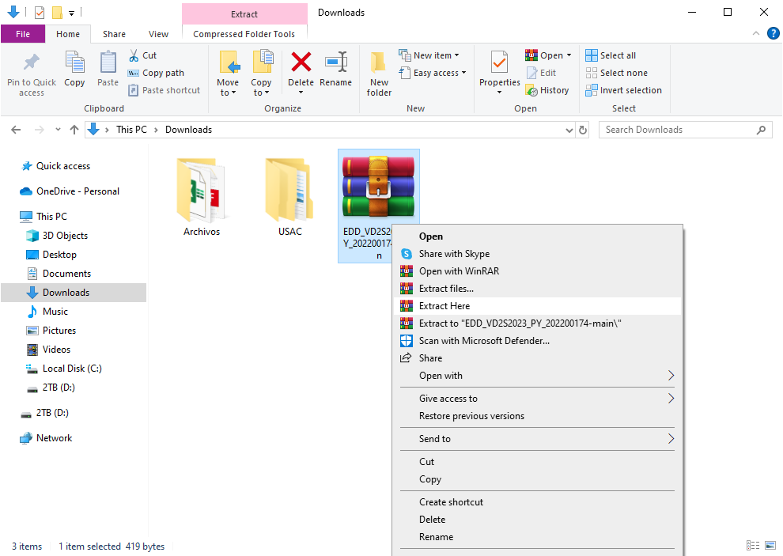
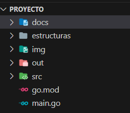
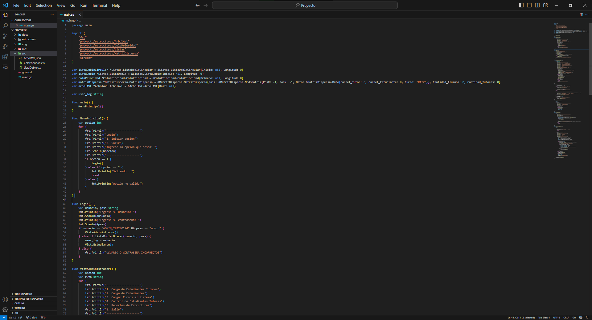

# Manual del Usuario - Tutorías ECYS
Nombre del Estudiante: Andres Alejandro Quezada Cabrera

Carné: 202200174

Curso y Sección: ESTRUCTURAS DE DATOS A

## Introducción

Bienvenido al Manual de Usuario de la aplicación de control para Tutorías de la Escuela de Ciencias y Sistemas (ECYS) de la Facultad de Ingeniería de la Universidad de San Carlos de Guatemala. Esta aplicación, diseñada para estudiantes tutores y aquellos que buscan recibir tutorías, es una herramienta integral que facilita la gestión y seguimiento de las tutorías académicas.

La iniciativa de la ECYS de reconocer y apoyar a los estudiantes tutores refleja el compromiso con la excelencia académica y el desarrollo estudiantil. Este manual proporcionará una guía detallada sobre cómo utilizar la aplicación, desde la creación de perfiles hasta el seguimiento de sesiones de tutoría y la evaluación del desempeño.

A través de esta plataforma, los tutores podrán registrar información relevante sobre sus habilidades, conocimientos y disponibilidad para impartir tutorías. Por otro lado, los estudiantes que buscan tutorías podrán buscar y conectarse con tutores que se adapten a sus necesidades académicas.

Este manual está diseñado para ser una herramienta accesible y comprensible para todos los usuarios, ya sean tutores experimentados, estudiantes en busca de tutorías o administradores de la ECYS. Le guiaremos a través de los procesos paso a paso, asegurando una experiencia fluida y efectiva con la aplicación de Tutorías ECYS.

Aproveche al máximo esta plataforma diseñada para fortalecer la comunidad estudiantil, fomentar el aprendizaje colaborativo y contribuir al éxito académico de todos los involucrados. ¡Bienvenido a Tutorías ECYS, donde el conocimiento se comparte y prospera!
### INSTALACIÓN DEL PROGRAMA Y USO DEL PROGRAMA
Ir al siguiente link: [MrQS94/EDD_VD2S2023_PY_202200174 (github.com)](https://github.com/MrQS94/EDD_VD2S2023_PY_202200174/). Acá encontrarán los src y el código fuente del programa.
 - Primero seleccionar en el botón code y seleccionar en descargar zip.

 - Luego de eso se descargará un archivo zip el cual necesitaremos extraer en una carpeta deseada, esta carpeta puede estar en cualquier lugar de su computadora, pero lo podemos incluir dentro de alguna carpeta de VS.

Abrimos el proyecto, luego de eso a nosotros nos aparecerá, cuatro paquetes los cuales son llamados estructuras, img, out, src y los manuales, en el paquete app se encuentra el archivo que inicia el programa main.go.
Ahora en el paquete controller se encuentran los siguientes archivos

El archivo de arranque sería el siguiente:
 - main.go
 - go.mod

## 1.Paquetes Importados:
Se importan paquetes estándar de Go (fmt y strconv) y paquetes definidos en el proyecto para estructuras de datos como árboles AVL, colas de prioridad, listas dobles y matrices dispersas.

## 2. Variables Globales:
Se declaran variables globales para diferentes estructuras de datos como listas dobles, colas de prioridad, matrices dispersas y árboles AVL.

## 3. Función Principal (main):
La función main simplemente llama a la función MenuPrincipal para iniciar la ejecución del programa.

## 4. Menú Principal (MenuPrincipal):
Estas funciones implementan un sistema de menús para interactuar con el programa. El usuario puede seleccionar diferentes opciones como iniciar sesión, cargar datos, realizar control de estudiantes, generar reportes, entre otros.

## 5. Función de Inicio de Sesión (Login):
Solicita al usuario que ingrese un nombre de usuario y una contraseña. Si el usuario es el administrador o se encuentra en la lista de estudiantes, se le redirige a la vista correspondiente.

## 6. Menú del Administrador (VistaAdministrador):
Ofrece opciones específicas para el administrador, como cargar datos de estudiantes tutores, cargar datos de estudiantes, cargar cursos, controlar estudiantes tutores y generar reportes.

## 7. Función de Reportes (Reportes):
Muestra informes sobre diferentes estructuras de datos como listas dobles, listas dobles circulares, matrices dispersas y árboles AVL.

## 8. Menú del Estudiante (VistaEstudiante):
Proporciona opciones para los estudiantes, como ver tutores disponibles, asignarse tutores y salir del menú.

## 9. Funciones (AsignarCurso) y (ControlEstudiantes):
Permiten a los estudiantes asignarse tutores para cursos específicos y al administrador controlar la aceptación o rechazo de estudiantes en una cola de prioridad.

El programa parece ser un sistema de gestión educativa que utiliza diversas estructuras de datos para administrar información sobre estudiantes, tutores, cursos y sesiones de tutoría. Los menús proporcionan una interfaz para que los usuarios interactúen con estas funcionalidades.