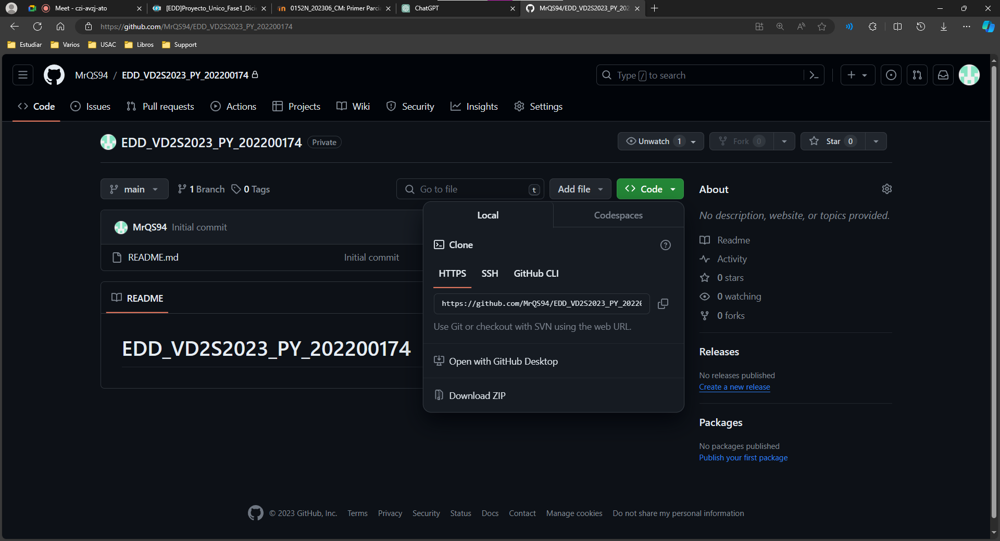
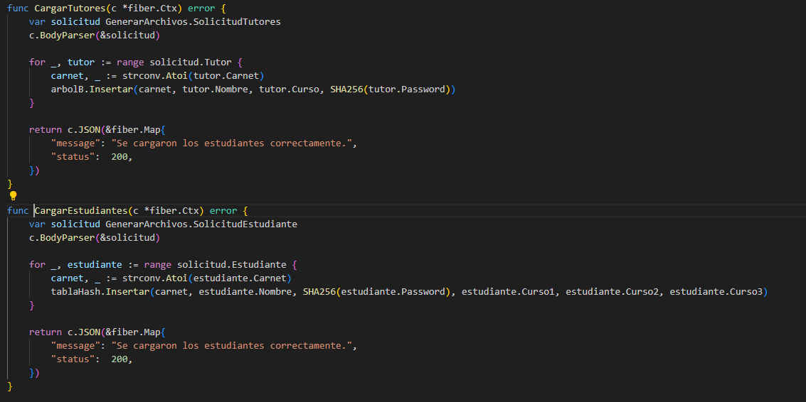
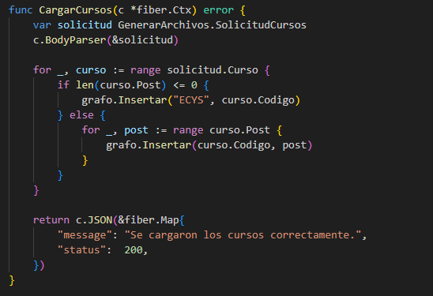
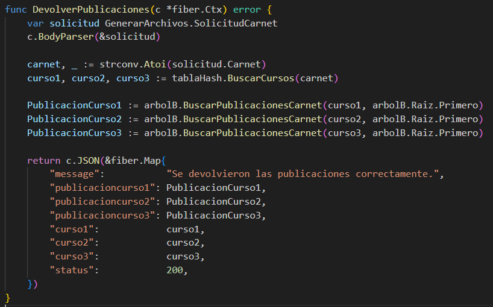

# Manual del Usuario - Tutorías ECYS
Nombre del Estudiante: Andres Alejandro Quezada Cabrera

Carné: 202200174

Curso y Sección: ESTRUCTURAS DE DATOS A

## Introducción

¡Bienvenido al Manual Técnico de nuestra Plataforma Educativa! Este documento proporciona una visión detallada de las funciones y tecnologías clave implementadas en nuestra plataforma, diseñada para ofrecer una gestión académica eficiente y una experiencia de aprendizaje colaborativo excepcional. A continuación, se presenta un resumen de los aspectos técnicos más relevantes:

1. Gestión de Datos Eficiente:

Árbol B y Tabla Hash: Implementamos un Árbol B para una gestión eficiente de libros y tutores, permitiendo búsquedas, inserciones y eliminaciones rápidas. La Tabla Hash optimiza la búsqueda de información relacionada con estudiantes y cursos.

2. Carga de Cursos y Planificación Académica:

Grafo Dirigido: Facilitamos la carga de cursos y sus dependencias mediante archivos JSON, visualizando conexiones a través de un grafo dirigido. Esto proporciona una herramienta efectiva para la planificación académica.

3. Integridad y Seguridad de Datos:

Árbol de Merkle: Garantizamos la integridad de las acciones y la seguridad del contenido mediante un árbol de Merkle, utilizado por los administradores para tomar decisiones sobre libros propuestos por tutores.

4. Gestión Eficiente de Contenido Educativo:

Codificación Base64: Los tutores pueden cargar libros y contenido educativo certificado y aprobado por el administrador, utilizando codificación Base64 para una gestión eficiente de archivos.

5. Experiencia Educativa Personalizada:

Acceso Diferenciado: Los usuarios, ya sean estudiantes, tutores o administradores, acceden a la plataforma de manera personalizada para adaptar la experiencia a sus necesidades específicas.

6. Reportes Visuales en Tiempo Real:

Representaciones Gráficas: Los administradores generan reportes visuales en tiempo real, proporcionando representaciones gráficas del árbol B, tabla hash, árbol de Merkle y grafo de cursos para una comprensión visual de la información.

7. Seguridad y Recomendaciones:

Encriptación y Tecnologías Robustas: Priorizamos la seguridad mediante la encriptación de contraseñas y el uso de tecnologías robustas para proteger la integridad de los datos. Recomendamos utilizar navegadores actualizados para una experiencia óptima.

### INSTALACIÓN DEL PROGRAMA Y USO DEL PROGRAMA
Ir al siguiente link: [MrQS94/EDD_VD2S2023_PY_202200174 (github.com)](https://github.com/MrQS94/EDD_VD2S2023_PY_202200174/). Acá encontrarán los src y el código fuente del programa.
 - Primero seleccionar en el botón code y seleccionar en descargar zip.

 - Luego de eso se descargará un archivo zip el cual necesitaremos extraer en una carpeta deseada, esta carpeta puede estar en cualquier lugar de su computadora, pero lo podemos incluir dentro de alguna carpeta de VS.

Abrimos el proyecto, luego de eso a nosotros nos aparecerá, cuatro paquetes los cuales son llamados estructuras, img, out, src y los manuales, en el paquete app se encuentra el archivo que inicia el programa main.go.
Ahora en el paquete controller se encuentran los siguientes archivos

El archivo de arranque sería escribir en la terminal cd backend y luego go run main.go, esto nos abrirá el programa en la terminal.
Ahora para el frontend será necesario cd frontend y luego npm run dev, esto nos abrirá el programa en el navegador.

## Login
Definición de la función LoginFiber:

La función maneja las solicitudes de inicio de sesión (login) recibidas en la ruta "/login".
Utiliza el contexto de Fiber (fiber.Ctx) para manejar la solicitud y la respuesta HTTP.

Análisis de la solicitud:

La función utiliza c.BodyParser(&solicitud) para analizar el cuerpo de la solicitud JSON y almacenar la información en la variable solicitud de tipo GenerarArchivos.SolicitudLogin.

Verificación de credenciales:

Compara el nombre de usuario (User) y la contraseña (Pass) de la solicitud con valores predefinidos (en este caso, "admin_202200174" y "admin").
Si las credenciales coinciden, se devuelve una respuesta JSON indicando un inicio de sesión exitoso con un rol de 1.

Manejo de roles:

Si las credenciales no coinciden con las del administrador, se verifica el valor de solicitud.Tutor.
Si Tutor es verdadero, se realiza una búsqueda en una estructura de datos tipo Árbol B (arbolB.Buscar).
Si Tutor es falso, se realiza una búsqueda en una Tabla Hash (tablaHash.Buscar).

Respuestas según la verificación:

Si se encuentra una coincidencia en la búsqueda, se devuelve una respuesta JSON indicando un inicio de sesión exitoso con un rol específico (2 o 3 según la búsqueda).
Si no se encuentra ninguna coincidencia, se devuelve una respuesta JSON indicando que no se pudo iniciar sesión.

Configuración de respuestas JSON:

Se utilizan mapas de Fiber para construir las respuestas JSON con mensajes, roles y códigos de estado correspondientes.

Configuración de la aplicación Fiber:

Se crea una nueva instancia de la aplicación Fiber (app := fiber.New()).
Se utiliza el middleware cors.New() para permitir solicitudes desde cualquier origen.

Definición de rutas:

Se define la ruta "/login" para manejar las solicitudes POST y utiliza la función LoginFiber para gestionar el inicio de sesión.

## Principal Admin

Función CargarEstudiantes:

Maneja las solicitudes para cargar información de estudiantes.
Utiliza c.BodyParser(&solicitud) para analizar el cuerpo de la solicitud JSON y almacenar la información en la variable solicitud de tipo GenerarArchivos.SolicitudEstudiante.
Itera sobre la lista de estudiantes en solicitud.Estudiante.
Convierte el carné del estudiante a un entero y utiliza la función tablaHash.Insertar para agregar la información del estudiante a una Tabla Hash.

Función CargarTutores:

Maneja las solicitudes para cargar información de tutores.
Similar a la función anterior, utiliza c.BodyParser(&solicitud) para analizar el cuerpo de la solicitud JSON y almacenar la información en la variable solicitud de tipo GenerarArchivos.SolicitudTutores.
Itera sobre la lista de tutores en solicitud.Tutor.
Convierte el carné del tutor a un entero y utiliza la función arbolB.Insertar para agregar la información del tutor a un Árbol B.

Función CargarCursos:

Maneja las solicitudes para cargar información de cursos.
Similar a las funciones anteriores, utiliza c.BodyParser(&solicitud) para analizar el cuerpo de la solicitud JSON y almacenar la información en la variable solicitud de tipo GenerarArchivos.SolicitudCursos.
Itera sobre la lista de cursos en solicitud.Curso.
Verifica la longitud de curso.Post y utiliza la función grafo.Insertar para agregar información del curso al Grafo.
Si la longitud de curso.Post es cero, se asume que el curso es independiente y se agrega directamente al grafo.

Respuestas JSON:

Después de cada operación de carga (estudiantes, tutores, cursos), se devuelve una respuesta JSON indicando que la operación se realizó correctamente con un código de estado 200.

## Tabla Alumnos

Método ConvertirArreglo en la estructura TablaHash:

Este método convierte la Tabla Hash en un arreglo de nodos ([]NodoHash).
Itera a través de la tabla hash y agrega los nodos no nulos al arreglo arrays.
Retorna el arreglo resultante.

Función TablaEstudiantes:

Maneja solicitudes para obtener información de la tabla de estudiantes.
Utiliza la función tablaHash.ConvertirArreglo() para obtener el arreglo de nodos de la tabla hash convertido.
Retorna una respuesta JSON que incluye un mensaje indicando que los estudiantes se enviaron correctamente, la tabla convertida y un código de estado 200.

Respuestas JSON:

Después de obtener la tabla de estudiantes convertida, se devuelve una respuesta JSON que incluye un mensaje informativo, la tabla convertida y un código de estado 200.

## Actualizar Estados

Método ActualizarEstado en la estructura ArbolB:

Este método busca un tutor en el Árbol B según su carné.
Dentro del tutor, busca un libro específico por nombre y actualiza su estado según el valor proporcionado.
Recorre el árbol de manera recursiva para buscar en los nodos izquierdos y, si es necesario, en los nodos derechos.

Función ActualizarEstado:

Maneja solicitudes para actualizar el estado de un libro.
Utiliza c.BodyParser(&solicitud) para analizar el cuerpo de la solicitud JSON y almacenar la información en la variable solicitud de tipo GenerarArchivos.SolicitudActualizar.
Convierte el carné de tutor a un entero.
Llama al método arbolB.ActualizarEstado con los parámetros correspondientes para actualizar el estado del libro en el Árbol B.
Retorna una respuesta JSON que indica que se actualizó el estado correctamente con un código de estado 200.

Respuestas JSON:

Después de actualizar el estado del libro, se devuelve una respuesta JSON que incluye un mensaje indicando que la actualización se realizó correctamente y un código de estado 200.

## Estudiante

Función TablaCursos:

Maneja solicitudes para obtener información de los cursos asociados a un estudiante.
Utiliza c.BodyParser(&solicitud) para analizar el cuerpo de la solicitud JSON y almacenar la información en la variable solicitud de tipo GenerarArchivos.SolicitudCarnet.
Convierte el carné del estudiante a un entero.
Llama a la función tablaHash.BuscarCursos con el carné del estudiante para obtener los cursos asociados.
Determina el código de estado (status) que se incluirá en la respuesta, inicialmente configurado en 200.
Verifica si los cursos devueltos son vacíos. Si son vacíos, actualiza el código de estado a 300.
Retorna una respuesta JSON que incluye un mensaje indicando que los cursos se enviaron correctamente, los nombres de los cursos y el código de estado.

Respuestas JSON:

Después de obtener la información de los cursos, se devuelve una respuesta JSON que incluye un mensaje informativo, los nombres de los cursos y el código de estado.

## Estudiante Libro

Función DevolverLibrosCarnet:

Maneja solicitudes para obtener información sobre los libros asociados a cursos específicos de un estudiante.
Utiliza c.BodyParser(&solicitud) para analizar el cuerpo de la solicitud JSON y almacenar la información en la variable solicitud de tipo GenerarArchivos.SolicitudCarnet.
Convierte el carné del estudiante a un entero.
Llama a tablaHash.BuscarCursos para obtener los nombres de los cursos asociados al estudiante.
Utiliza el Árbol B (arbolB) para buscar los libros asociados a cada curso.
Retorna una respuesta JSON que incluye un mensaje indicando que se devolvieron los libros correctamente, la información sobre los libros para cada curso, los nombres de los cursos y un código de estado.

Respuestas JSON:

Después de obtener la información de los libros, se devuelve una respuesta JSON que incluye un mensaje informativo, la información sobre los libros para cada curso, los nombres de los cursos y el código de estado.

## Estudiante Publicación

Función DevolverPublicaciones:

Maneja solicitudes para obtener información sobre las publicaciones asociadas a cursos específicos de un estudiante.
Utiliza c.BodyParser(&solicitud) para analizar el cuerpo de la solicitud JSON y almacenar la información en la variable solicitud de tipo GenerarArchivos.SolicitudCarnet.
Convierte el carné del estudiante a un entero.
Llama a tablaHash.BuscarCursos para obtener los nombres de los cursos asociados al estudiante.
Utiliza el Árbol B (arbolB) para buscar las publicaciones asociadas a cada curso.
Retorna una respuesta JSON que incluye un mensaje indicando que se devolvieron las publicaciones correctamente, la información sobre las publicaciones para cada curso, los nombres de los cursos y un código de estado.

Respuestas JSON:

Después de obtener la información de las publicaciones, se devuelve una respuesta JSON que incluye un mensaje informativo, la información sobre las publicaciones para cada curso, los nombres de los cursos y el código de estado.

## Principal Tutor

Función CargarTutores:

Maneja solicitudes para cargar información de tutores.
Utiliza c.BodyParser(&solicitud) para analizar el cuerpo de la solicitud JSON y almacenar la información en la variable solicitud de tipo GenerarArchivos.SolicitudTutores.
Itera sobre la lista de tutores en solicitud.Tutor.
Convierte el carné del tutor a un entero.
Llama a la función arbolB.Insertar para insertar la información del tutor en el Árbol B.
Retorna una respuesta JSON que indica que se cargaron los tutores correctamente con un código de estado 200.

Respuestas JSON:

Después de cargar la información de los tutores en el Árbol B, se devuelve una respuesta JSON que incluye un mensaje indicando que se cargaron los tutores correctamente y un código de estado 200.

## Tutor Libro

Función CargarLibro:

Maneja solicitudes para cargar información de libros.
Utiliza c.BodyParser(&solicitud) para analizar el cuerpo de la solicitud JSON y almacenar la información en la variable solicitud de tipo GenerarArchivos.SolicitudLibro.
Convierte el carné del estudiante a un entero.
Llama a la función arbolB.GuardarLibro para guardar la información del libro en el Árbol B.
Retorna una respuesta JSON que indica que se cargaron los libros correctamente con un código de estado 200.

Respuestas JSON:

Después de cargar la información del libro en el Árbol B, se devuelve una respuesta JSON que incluye un mensaje indicando que se cargaron los libros correctamente y un código de estado 200.

## Tutor Publicación

Función CargarPubli:

Maneja solicitudes para cargar información de publicaciones.
Utiliza c.BodyParser(&solicitud) para analizar el cuerpo de la solicitud JSON y almacenar la información en la variable solicitud de tipo GenerarArchivos.SolicitudPublicacion.
Convierte el carné del estudiante a un entero.
Llama a la función arbolB.GuardarPubli para guardar la información de la publicación en el Árbol B.
Retorna una respuesta JSON que indica que se cargaron las publicaciones correctamente con un código de estado 200.

Respuestas JSON:

Después de cargar la información de la publicación en el Árbol B, se devuelve una respuesta JSON que incluye un mensaje indicando que se cargaron las publicaciones correctamente y un código de estado 200.

## Cursos

Función CargarCursos:

Maneja solicitudes para cargar información de cursos.
Utiliza c.BodyParser(&solicitud) para analizar el cuerpo de la solicitud JSON y almacenar la información en la variable solicitud de tipo GenerarArchivos.SolicitudCursos.
Itera sobre la lista de cursos en solicitud.Curso.
Verifica la longitud de curso.Post. Si es cero, se asume que el curso es independiente y se inserta directamente en el Grafo con el código "ECYS".
Si la longitud de curso.Post es mayor que cero, se itera sobre los posts y se inserta cada uno en el Grafo asociado al curso.
Retorna una respuesta JSON que indica que se cargaron los cursos correctamente con un código de estado 200.

Respuestas JSON:

Después de cargar la información de los cursos en el Grafo, se devuelve una respuesta JSON que incluye un mensaje indicando que se cargaron los cursos correctamente y un código de estado 200.

## Admin Reportes

Generación de Gráficos del Árbol B:

Llama al método arbolB.Graficar() para generar un gráfico del Árbol B.
Este gráfico visualiza la estructura del Árbol B.

Generación de Reportes del Grafo:

Llama al método grafo.Reporte() para generar un reporte del Grafo.
Este reporte puede incluir información sobre los nodos y las relaciones en el Grafo.

Operaciones con el Árbol Merkle:

Inicializa una instancia de la estructura ArbolMerkle llamada arbolMerkle.
Llama a arbolB.GraficarMerkle para obtener la estructura del Árbol B en formato de Árbol Merkle.
Llama a arbolMerkle.GenerarArbol() para generar el Árbol Merkle basado en los bloques de datos actuales.
Llama a arbolMerkle.Graficar() para generar un gráfico del Árbol Merkle.

Respuestas JSON:

Después de realizar las operaciones de generación de gráficos y reportes, se devuelve una respuesta JSON que indica que se generaron los archivos correctamente con un código de estado 200.

## Actualizar Libros

Función ActualizarEstado:

Maneja solicitudes para actualizar el estado de un libro en el Árbol B.
Utiliza c.BodyParser(&solicitud) para analizar el cuerpo de la solicitud JSON y almacenar la información en la variable solicitud de tipo GenerarArchivos.SolicitudActualizar.
Convierte el carné del estudiante a un entero.
Llama al método arbolB.ActualizarEstado con los parámetros correspondientes para actualizar el estado del libro en el Árbol B.
Retorna una respuesta JSON que indica que se actualizó el estado correctamente con un código de estado 200.

Función DevolverLibros:

Maneja solicitudes para devolver libros que tienen un estado específico en el Árbol B.
Llama al método arbolB.DevolverLibros para obtener todos los libros del Árbol B.
Filtra los libros que tienen un estado igual a 0 (suponiendo que 0 indica un estado específico).
Retorna una respuesta JSON que incluye un mensaje indicando que se actualizó el estado correctamente, la lista de libros con el estado deseado y un código de estado 200.

Respuestas JSON en Ambas Funciones:

Ambas funciones devuelven una respuesta JSON que incluye un mensaje informativo y un código de estado 200.

# Estructuras

## Arbol B

Características:

Los árboles B son estructuras de datos balanceadas que permiten la rápida búsqueda, inserción y eliminación de elementos.
Cada nodo en el árbol B puede contener múltiples claves y múltiples hijos, y sigue un orden específico.
Se utiliza comúnmente en bases de datos y sistemas de archivos para organizar y gestionar grandes cantidades de información de manera eficiente.

Motivos del Uso:

Los árboles B son ideales para gestionar información como libros y tutores en tu aplicación debido a su eficiencia en búsquedas y manejo de grandes cantidades de datos.
El orden balanceado del árbol B garantiza un rendimiento eficiente en operaciones clave, lo que lo hace especialmente útil cuando se trabaja con grandes conjuntos de datos.

## Tabla Hash

Características:

Una tabla de dispersión asocia claves con valores mediante una función hash.
Utiliza una función hash para transformar claves en índices en la tabla, permitiendo búsquedas rápidas.
Ideal para acceso rápido y eficiente a datos cuando se conoce la clave.

Motivos del Uso:

La tabla de dispersión es útil para la búsqueda rápida de información relacionada con estudiantes y cursos en tu aplicación.
Proporciona un acceso constante a los datos, lo que es beneficioso en operaciones frecuentes de búsqueda y recuperación.

## Grafo Dirigido

Características:

Un grafo consta de nodos (vértices) y conexiones entre ellos (aristas).
Modela relaciones complejas entre entidades y se utiliza para representar estructuras de red.
Puede ser dirigido o no dirigido y contener ciclos o ser acíclico.

Motivos del Uso:

Los grafos son ideales para representar relaciones entre cursos y publicaciones en tu aplicación.
Facilitan la visualización y navegación de conexiones complejas entre entidades, proporcionando una representación gráfica de la información.

## Árbol Merkle

Características:

Un árbol Merkle es una estructura de datos de árbol binario donde cada hoja es el hash de un bloque de datos.
Utilizado en criptografía para verificar la integridad y autenticidad de datos en sistemas distribuidos o blockchain.

Motivos del Uso:

Los árboles Merkle se utilizan para garantizar la integridad y autenticidad de los datos almacenados en el Árbol B en tu aplicación.
Son fundamentales en entornos donde la seguridad de la información es crucial, ya que permiten detectar cualquier cambio no autorizado en los datos.

