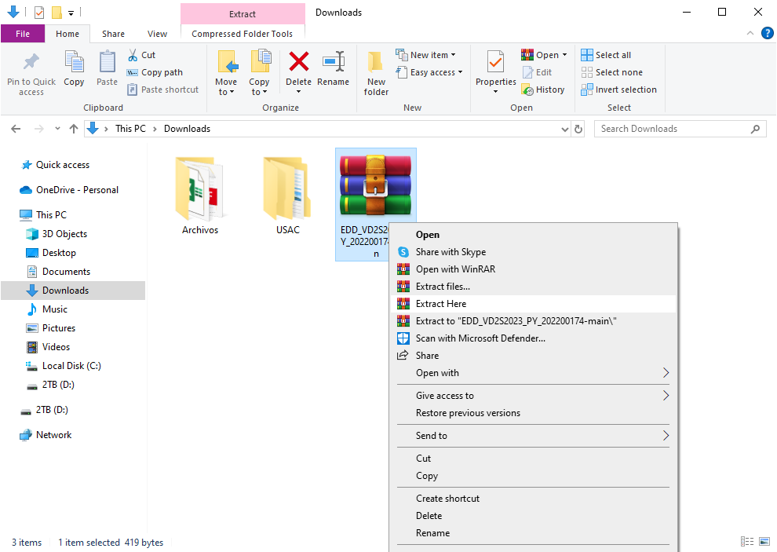

# Manual del Usuario - Tutorías ECYS
Nombre del Estudiante: Andres Alejandro Quezada Cabrera

Carné: 202200174

Curso y Sección: ESTRUCTURAS DE DATOS A

## Introducción

Bienvenido a nuestra Plataforma Educativa, diseñada para brindar una gestión académica eficiente y una experiencia de aprendizaje colaborativo excepcional. Este manual te guiará a través de las funciones clave para estudiantes, tutores y administradores, asegurando una navegación fluida y efectiva. Accede a la plataforma de manera personalizada, diferenciando entre estudiantes, tutores y administradores para adaptar la experiencia a tus necesidades específicas. Los administradores pueden realizar cargas masivas de datos para tutores y estudiantes, optimizando la eficiencia mediante estructuras como el árbol B y la tabla hash. Facilitamos la carga de cursos y sus dependencias mediante archivos JSON, visualizando conexiones a través de un grafo dirigido para una planificación académica efectiva. Los administradores toman decisiones sobre libros propuestos por tutores, utilizando un árbol de Merkle para garantizar la integridad de las acciones y la seguridad del contenido. Los tutores pueden cargar libros y contenido educativo certificado y aprobado por el administrador, utilizando codificación Base64 para una gestión eficiente de archivos Los estudiantes acceden a cursos asignados, visualizan libros aceptados y lecciones publicadas por tutores para una experiencia educativa personalizada Los administradores generan reportes visuales en tiempo real, proporcionando representaciones gráficas del árbol B, tabla hash, árbol de Merkle y grafo de cursos.

Nota: Priorizamos la seguridad mediante la encriptación de contraseñas y el uso de tecnologías robustas para proteger la integridad de los datos. Recomendamos utilizar navegadores actualizados para una experiencia óptima.

### INSTALACIÓN DEL PROGRAMA Y USO DEL PROGRAMA
Ir al siguiente link: [MrQS94/EDD_VD2S2023_PY_202200174 (github.com)](https://github.com/MrQS94/EDD_VD2S2023_PY_202200174/). Acá encontrarán los src y el código fuente del programa.
 - Primero seleccionar en el botón code y seleccionar en descargar zip.

 - Luego de eso se descargará un archivo zip el cual necesitaremos extraer en una carpeta deseada, esta carpeta puede estar en cualquier lugar de su computadora, pero lo podemos incluir dentro de alguna carpeta de VS.

Abrimos el proyecto, luego de eso a nosotros nos aparecerá, cuatro paquetes los cuales son llamados estructuras, img, out, src y los manuales, en el paquete app se encuentra el archivo que inicia el programa main.go.
Ahora en el paquete controller se encuentran los siguientes archivos

El archivo de arranque sería escribir en la terminal cd backend y luego go run main.go, esto nos abrirá el programa en la terminal.
Ahora para el frontend será necesario cd frontend y luego npm run dev, esto nos abrirá el programa en el navegador.

## Login
Al iniciar el programa nos aparecerá la siguiente pantalla, en la cual nos pedirá un usuario y una contraseña, en este caso el usuario es admin y la contraseña es admin, esto nos llevará a la siguiente pantalla.

## Principal Admin

Cargar Estudiantes:

Un botón con la etiqueta "Cargar Estudiantes | TablaHash" que permite al usuario seleccionar y cargar un archivo CSV con información de estudiantes.
Cargar Tutores:

Un botón con la etiqueta "Cargar Tutores | ArbolB" que facilita la carga de un archivo CSV conteniendo datos de tutores.
Cargar Cursos:

Un botón con la etiqueta "Cargar Cursos | Grafos" destinado a cargar un archivo JSON que contiene información relacionada con cursos.
Reportes:

Un botón con la etiqueta "Reportes" que activa la generación de informes al hacer clic.
Tabla Alumnos:

Un botón con la etiqueta "Tabla Alumnos" que redirige al usuario a una sección específica de la aplicación al ser seleccionado.
Aceptar Libros:

Un botón con la etiqueta "Aceptar Libros" que, al ser seleccionado, lleva al usuario a otra sección de la aplicación.
Salir:

Un botón con la etiqueta "Salir" que cierra la sesión del usuario y lo redirige a la página principal.

## Tabla Alumnos

Datos de Estudiantes:

Utiliza el estado alumnosRegistrados y el efecto useEffect para realizar una solicitud a la API en http://localhost:4000/tabla-estudiantes al cargar la página y actualizar el estado con la información resultante.
Interfaz de Usuario:

La interfaz utiliza una estructura de tarjeta con un formulario y una tabla para presentar la información.
Se muestra un encabezado con el título "Administrador" y un subtítulo "Cargar Archivos".
La tabla utiliza la clase table de Bootstrap y tiene columnas para "#", "Posicion", "Carnet", y "Password".
Contenido de la Tabla:

Se utiliza un mapeo sobre el estado alumnosRegistrados para mostrar cada estudiante en una fila de la tabla.
La información incluye el número de posición, la llave, el carnet y la contraseña de cada estudiante.
Información Adicional:

Se incluye un mensaje de texto en la parte inferior con el número de identificación "EDD 202200174".

## Aceptar Libros

Estado y Efecto de Carga Inicial:

Utiliza el estado libros para almacenar la información sobre los libros y contenido para el contenido del libro seleccionado.
Utiliza el efecto useEffect para realizar una solicitud a la API en http://localhost:4000/devolver-libros al cargar la página y actualizar el estado con la información resultante.
Funciones Manejadoras de Eventos:

handleContenido: Actualiza el estado carnet1 y retorna el contenido del libro seleccionado cuando se elige un libro del menú desplegable.
handleOnChange: Invocado cuando se selecciona un libro del menú desplegable, actualiza el estado contenido con el contenido del libro seleccionado.
handleAceptar y handleRechazar: Realizan solicitudes a la API en http://localhost:4000/actualizar-estado para aceptar o rechazar un libro, respectivamente. Muestra alertas después de realizar la acción.
volver: Redirige al usuario de vuelta a la página principal del administrador.
Interfaz de Usuario:

Interfaz de tarjeta con un formulario que incluye un título, menú desplegable para seleccionar libros, un iframe para mostrar el contenido del libro seleccionado y botones para aceptar, rechazar y volver.
Utiliza Bootstrap para el estilo de los botones y otros elementos de la interfaz.

## Estudiante

Este código representa una página para estudiantes en React, mostrando información sobre los cursos que está tomando el estudiante y proporcionando opciones para ver libros y publicaciones. Aquí hay una descripción de los elementos clave:

Estado y Efecto de Carga Inicial:

Utiliza el estado cursos para almacenar la información sobre los cursos del estudiante.
Utiliza el efecto useEffect para realizar una solicitud a la API en http://localhost:4000/tabla-cursos al cargar la página y actualizar el estado con la información resultante, utilizando el carnet del estudiante almacenado en el localStorage.

Funciones Manejadoras de Eventos:

salir: Cierra la sesión del estudiante y redirige a la página principal.
changeCargarLibro y changeCargarPublicacion: Redirigen al estudiante a las páginas correspondientes al hacer clic en los botones.
Interfaz de Usuario:

Interfaz de tarjeta con un formulario que incluye un título de bienvenida, una tabla que muestra los cursos, botones para ver libros y publicaciones, y un botón para salir.
La tabla presenta los cursos en tres columnas (Curso 1, Curso 2, Curso 3).
Utiliza Bootstrap para el estilo de los botones y otros elementos de la interfaz.

## Estudiante Libro

Este código representa una página para estudiantes en React, diseñada para mostrar libros en formato PDF relacionados con los cursos del estudiante. Aquí tienes una descripción de los elementos clave:

Estado:

Utiliza el estado para almacenar información sobre cursos (curso1, curso2, curso3) y libros (libro1, libro2, libro3).

Función de Carga de Libros:
fetchData: Realiza una solicitud a la API en http://localhost:4000/devolver-libros-carnet al hacer clic en el botón "Cargar Libros". Actualiza el estado con la información resultante.

Función para Visualizar Libros:
handleVerLibro: Actualiza el estado libro con el contenido del libro seleccionado al hacer clic en el botón "Ver".

Interfaz de Usuario:
Interfaz de tarjeta con un formulario que incluye un título de bienvenida, un título para los libros en PDF y botones para cargar libros.
Utiliza un diseño de dos columnas para mostrar los cursos y los libros asociados.
Muestra un botón "Ver" junto a cada libro para permitir a los estudiantes visualizar el contenido del libro seleccionado.
Utiliza un iframe para mostrar el contenido del libro seleccionado.

## Estudiante Publicación
Estado:

Utiliza el estado para almacenar información sobre cursos (curso1, curso2, curso3) y publicaciones (publi1, publi2, publi3).

Función de Carga de Publicaciones:
fetchData: Realiza una solicitud a la API en http://localhost:4000/devolver-publicaciones al hacer clic en el botón "Cargar Publicaciones". Actualiza el estado con la información resultante.

Interfaz de Usuario:
Interfaz de tarjeta con un formulario que incluye un título de bienvenida, un título para las publicaciones y un botón para cargar las publicaciones.
Utiliza un diseño de dos columnas para mostrar los cursos y las publicaciones asociadas.

Muestra un área de texto para cada publicación, que contiene el contenido de las publicaciones seleccionadas.

## Principal Tutor

Estado:

Utiliza el estado para almacenar información sobre cursos (curso1, curso2, curso3) y publicaciones (publi1, publi2, publi3).

Función de Carga de Publicaciones:
fetchData: Realiza una solicitud a la API en http://localhost:4000/devolver-publicaciones al hacer clic en el botón "Cargar Publicaciones". Actualiza el estado con la información resultante.

Interfaz de Usuario:
Interfaz de tarjeta con un formulario que incluye un título de bienvenida, un título para las publicaciones y un botón para cargar las publicaciones.
Utiliza un diseño de dos columnas para mostrar los cursos y las publicaciones asociadas.
Muestra un área de texto para cada publicación, que contiene el contenido de las publicaciones seleccionadas.

## Tutor Libro

Estado:

Utiliza el estado (contenidoPDF) para almacenar el contenido del archivo PDF seleccionado.

Función para Cargar Libros:
uploadFileTutor: Se activa cuando se selecciona un archivo PDF. Lee el contenido del archivo, lo muestra en un iframe y realiza una solicitud a la API en http://localhost:4000/cargar-libro para cargar el libro. Muestra una alerta indicando si la carga fue exitosa o no.

Interfaz de Usuario:
Interfaz de tarjeta con un formulario que incluye un título de bienvenida, un título para cargar PDF y un input de tipo archivo para seleccionar el archivo PDF.
Utiliza un iframe para mostrar el contenido del archivo PDF seleccionado.

## Tutor Publicación

Estado:

Utiliza el estado (contenidoPubli) para almacenar el contenido de la publicación.

Funciones:
guardarPublicacion: Se activa cuando se envía el formulario. Realiza una solicitud a la API en http://localhost:4000/cargar-publicacion para guardar la publicación. Muestra una alerta indicando si la carga fue exitosa o no.
salir: Cierra la sesión del tutor y redirige a la página principal.

Interfaz de Usuario:
Interfaz de tarjeta con un formulario que incluye un título de bienvenida, un título para cargar publicación y un área de texto para escribir la publicación.
Botón para enviar la publicación.
Botón para salir de la sesión.
Muestra el código de estudiante (EDD 202200174) como información adicional.

