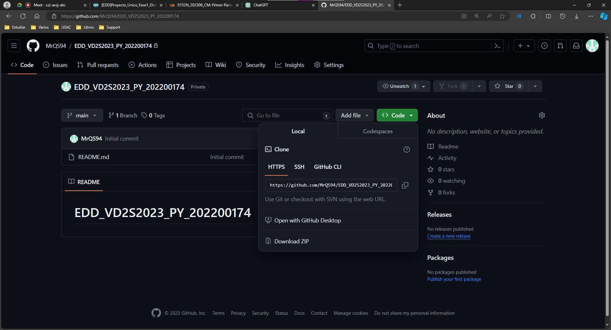
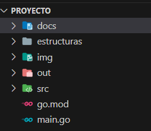

# Manual Técnico - Tutorías ECYS
Nombre del Estudiantes: Andres Alejandro Quezada Cabrera

Carné: 202200174

Curso y Sección: ESTRUCTURAS DE DATOS A

## Introducción

El presente manual técnico proporciona una guía exhaustiva sobre la aplicación desarrollada para gestionar y llevar un control eficiente de las tutorías ofrecidas por estudiantes de la Escuela de Ciencias y Sistemas de la Facultad de Ingeniería de la Universidad de San Carlos de Guatemala, en adelante referida como ECYS.

Esta iniciativa surge como respuesta a la destacada labor de estudiantes que han demostrado ser tutores académicos de alta calidad, contribuyendo significativamente al desarrollo académico de otros estudiantes. La evaluación de estos tutores abarca aspectos como presentación, formalidad, conocimientos y habilidades en diversas áreas de estudio. En reconocimiento a su labor, la escuela ha decidido otorgarles incentivos con el respaldo de la universidad, con el objetivo de fomentar la participación de estos tutores y facilitar la tutoría a estudiantes en diferentes etapas de su carrera.

La aplicación desarrollada, cuyo enfoque principal es gestionar las tutorías, se presenta como una herramienta fundamental para llevar un seguimiento detallado de los tutores y de aquellos estudiantes que buscan recibir tutorías en distintas etapas de su formación académica. Este manual técnico se ha diseñado para proporcionar información detallada sobre la instalación, configuración y uso de la aplicación, con el fin de garantizar su correcto funcionamiento y maximizar su utilidad para los usuarios.

A lo largo de este documento, se abordarán aspectos técnicos relacionados con el desarrollo de la aplicación, la estructura de la base de datos, las funcionalidades clave, y cualquier otro detalle técnico relevante. Se espera que este manual sirva como una referencia clara y completa para todos aquellos involucrados en la implementación y uso de la aplicación de Tutorías ECYS.

### INSTALACIÓN DEL PROGRAMA Y USO DEL PROGRAMA
Ir al siguiente link: [MrQS94/EDD_VD2S2023_PY_202200174 (github.com)](https://github.com/MrQS94/EDD_VD2S2023_PY_202200174/). Acá encontrarán los src y el código fuente del programa.
 - Primero seleccionar en el botón code y seleccionar en descargar zip.

 - Luego de eso se descargará un archivo zip el cual necesitaremos extraer en una carpeta deseada, esta carpeta puede estar en cualquier lugar de su computadora, pero lo podemos incluir dentro de alguna carpeta de VS.

Abrimos el proyecto, luego de eso a nosotros nos aparecerá, cuatro paquetes los cuales son llamados estructuras, img, out, src y los manuales, en el paquete app se encuentra el archivo que inicia el programa main.go.
Ahora en el paquete controller se encuentran los siguientes archivos

El archivo de arranque sería el siguiente:
 - main.go
 - go.mod

## 1.Paquetes Importados:
El código importa diferentes paquetes que contienen implementaciones de estructuras de datos como árboles AVL, colas de prioridad, listas dobles, y matrices dispersas, así como el paquete "fmt" para el manejo de formato y la conversión de datos.

## 2. Variables Globales:
Se declaran variables globales para representar instancias de las estructuras de datos mencionadas y una variable user_log para almacenar el nombre de usuario después del inicio de sesión.

## 3. Función Principal (main):
El programa comienza ejecutando la función MenuPrincipal, que es el punto de entrada principal.

## 4. Menú Principal (MenuPrincipal):
La función MenuPrincipal muestra un menú para iniciar sesión o salir, y se ejecuta en un bucle hasta que el usuario elige salir.

## 5. Función de Inicio de Sesión (Login):
La función Login maneja el inicio de sesión, verificando las credenciales para el administrador y estudiantes.

## 6. Menú del Administrador (VistaAdministrador):
La función VistaAdministrador presenta un menú con diversas opciones para el administrador, como cargar datos, controlar estudiantes, generar reportes, entre otras.

## 7. Función de Reportes (Reportes):
La función Reportes genera informes sobre las estructuras de datos utilizadas, como listas dobles, listas circulares, matrices dispersas y árboles AVL.

## 8. Menú del Estudiante (VistaEstudiante):
La función VistaEstudiante muestra un menú para que los estudiantes vean tutores disponibles, se asignen tutores y salgan del sistema.

## 9. Asignación de Curso (AsignarCurso):
La función AsignarCurso permite a los estudiantes asignarse a sí mismos como tutores para cursos específicos.

## 10. Control de Estudiantes (ControlEstudiantes):
La función ControlEstudiantes gestiona la aceptación o rechazo de estudiantes en la cola de prioridad.

El código implementa un sistema que administra tutorías, permitiendo a los administradores cargar datos, controlar estudiantes y generar informes, mientras que los estudiantes pueden ver tutores disponibles, asignarse tutores y salir del sistema. Las estructuras de datos utilizadas incluyen listas dobles, colas de prioridad, matrices dispersas y árboles AVL.